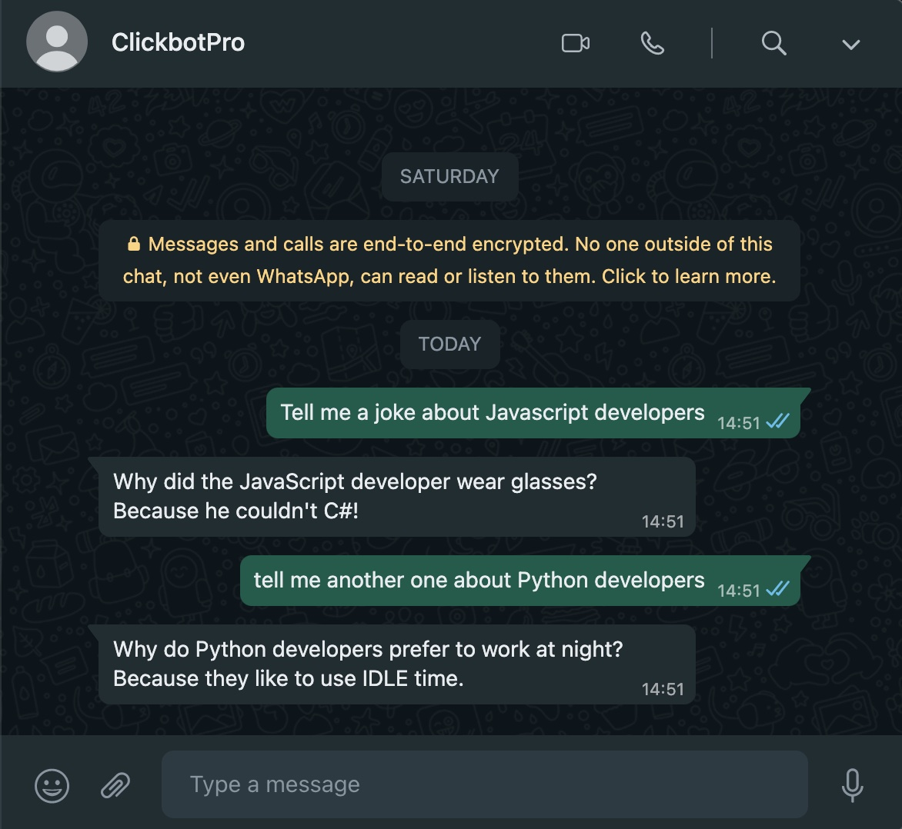

## About PDF-Merger


Use the [ClickbotPro app](https://clickbot.pro) with this bot to have a user-friendly interface. Once you start it, the bot will reply to your contacts on your behalf using ChatGPT. In the Input-Settings, you can choose which contacts you want it to affect. It will always respond to your own messages.

To get started, you need to link this bot to your WhatsApp by scanning a QR code and providing the initial prompt.
For example:
```bash
- Pretend to be my friend Kyle, using typos and short phrases.
- Pretend to be a ninja who's trying to live a peaceful life. Use short answers. Stay in character forever.
- Communicate only using only descriptive gestures. Don't write text.
```

Limitations:
```bash
- If you don't provide your own ChatGPT API key, there is a limit of 100 messages per day.
- It will only respond to new/unread messages. Archived messages will be ignored.
```

## Installation

The installation can take place through ClickbotPro or via the npm CLI.

```bash
npm i whatsapp-chatgpt
```

After the installation, import this bot into the application. Click the Plus (+) button and select "Import Extension"


## Usage

Start the extension by clicking the start button. Next, use your phone, where you have WhatsApp installed, to scan the QR code.


If you want the bot to autostart every time you start your computer, set up a schedule.


Thats it. ClickbotPro will continue working in the background and print all messages in the log window.




## Other sources

[ClickbotPro website](https://clickbot.pro)

[Discord server](https://discord.gg/CNh88zDTPh)

## License

[MIT](https://choosealicense.com/licenses/mit/)