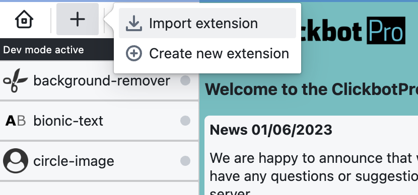
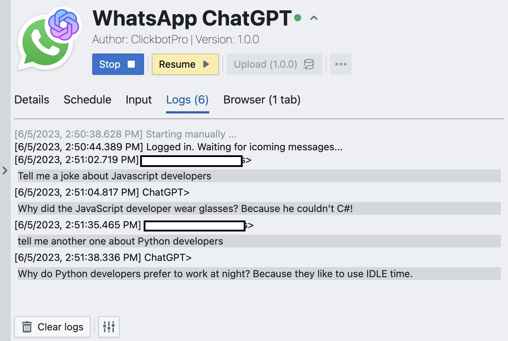
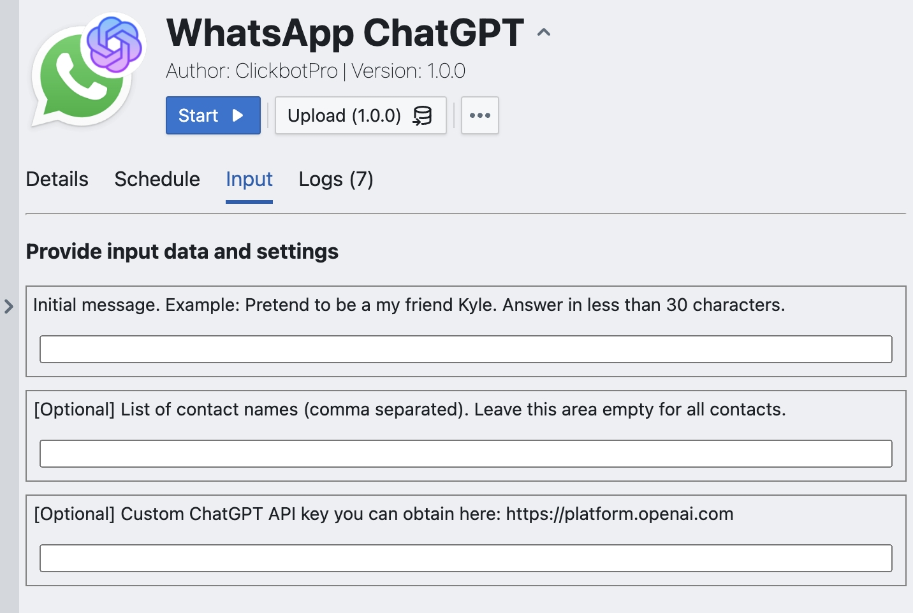

## About PDF-Merger


Use this module with the [ClickbotPro app](https://clickbot.pro) to put multiple PDF files together. It has an easy-to-use setup where you can pick input and output files, plus other handy settings. 
You can even add images in between the PDFs. 
The files will merge in the order of their names. So, just name them in the order you want. You might use a numbered list like this:

```bash
1-invoice123.pdf
2-documentX.pdf
3-screenshot.png
4-documentation.pdf
```

## Installation

The installation can take place through ClickbotPro or via the npm CLI.

```bash
npm i pdf-merger-bot
```

After the installation, import this module into the application. Click the Plus (+) button and select "Import Extension."



## Usage

Select the input folder with files you want to merge:


Set up a schedule if you want to automate the merging:



Alternatively, hit the Start button to initiate this module. The merged file will be copied into a preset output folder or the one you've defined in the input settings:



## Other sources

[ClickbotPro website](https://clickbot.pro)

[Discord server](https://discord.gg/CNh88zDTPh)

## License

[MIT](https://choosealicense.com/licenses/mit/)